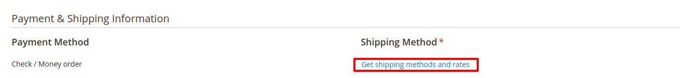

# Magento 2 Free Shipping Admin Module
Enhance your Magento 2 store's shipping management with the FreeShippingAdmin Module. This module allows administrators to easily configure and manage free shipping options from the Magento admin panel, making it simpler to create promotional offers and optimize shipping strategies.

## Key Features:
- **Admin-Controlled Free Shipping:**
 Easily configure free shipping rules and conditions directly from the Magento admin panel.
- **Customizable Rules:**
 Define specific conditions for free shipping, including minimum order amounts, product categories, or customer groups.
- **Promotional Flexibility:**
 Create promotional free shipping campaigns to drive sales and improve customer satisfaction.
- **Compatibility:**
 Compatible with Magento 2.4.X and supports PHP versions 8.1 to 8.3.
- **Easy Installation:**
 Install via composer for straightforward setup and updates.
- **Update/Upgrade:**
 Seamlessly update using composer and Magento CLI commands.
- **Error Handling:**
 Robust error handling to maintain stability and reliability.

## Benefits:
- **Streamlined Shipping Management:**
 Simplify the process of setting up and managing free shipping offers and rules.
- **Enhanced Promotional Capabilities:**
 Drive sales with targeted free shipping promotions tailored to specific conditions.
- **User-Friendly Interface:**
 Manage free shipping options easily through Magento's intuitive admin interface.
- **Support and Documentation:**
 Comprehensive support available for installation, configuration, and troubleshooting.

## Compatibility:
This extension is compatible with Magento 2.4.X (PHP - 8.1 - 8.3) version.

## Installation:
*Install via composer (recommend)* - 

Easy installation process with step-by-step instructions provided for hassle-free setup.
~~~~~~~~~~~~~~~~~~~~~
php bin/magento module:enable mavenbird/module-freeshippingadmin
php bin/magento setup:upgrade
php bin/magento setup:static-content:deploy
php bin/magento cache:flush
Manual Installation:
Download the latest release from GitHub releases.
~~~~~~~~~~~~~~~~~~~~~

## Upgrade/Update Module:
Run the following command in Magento 2 root folder for easy update -
~~~~~~~~~~~~~~~~~~~~~
php bin/magento module:enable mavenbird/module-freeshippingadmin
php bin/magento setup:upgrade
php bin/magento setup:static-content:deploy
php bin/magento cache:flush
~~~~~~~~~~~~~~~~~~~~~

## Customization Options:

## Support:
Dedicated support team available to assist with installation, customization, and any other queries or concerns.
*[support@mavenbird.com](mailto:support@mavenbird.com)* 

## Get Started:
Optimize your store's shipping strategy with the Magento 2 FreeShippingAdmin Module. Easily manage and configure free shipping options to enhance customer experience and boost sales.
*Thank you!*
